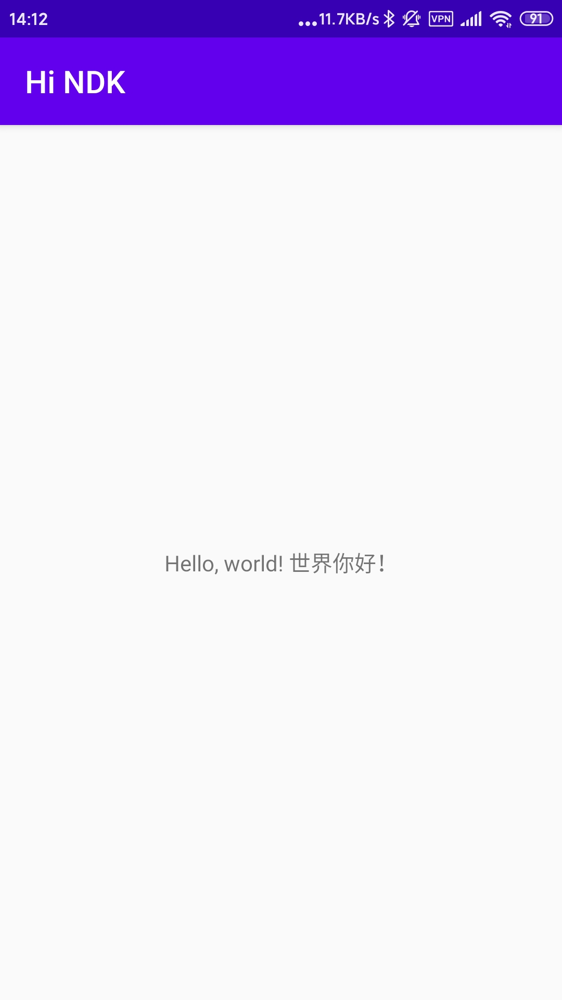

金老师这周给我们布置的任务是：“交叉编译一个共享库（Shared Object），在安卓手机中加载它，显示一个Hello, world。”

要实现这一个目标有很多种途径，最简单的应该算是使用Android Studio中集成好的NDK。Anroid开发基本上离不开Android Studio。

NDK是额外组件，需要通过Android Studio中的SDK Manager进行安装。安装时还可以勾选构建工具CMake和调试用的LLDB。

安装完所有需要的组件后就万事俱备了。凭空将C++引入Android开发，最简单的方法就是从Native C++模板新建Android项目。

不过，从Native C++模板新建的项目有可能会默认选择其他NDK版本而拒绝使用当前的安装的NDK。这时，在模块的`build.gradle`配置文件中将NDK的版本指定为当前安装的版本即可。

``` groovy
apply plugin: 'com.android.application'

android {
    compileSdkVersion 28
    defaultConfig {
        // ...
    }

    buildTypes {
        // ...
    }

    // 在这里指定NDK版本。
    ndkVersion "21.0.6113669"

    externalNativeBuild {
        cmake {
            path "src/main/cpp/CMakeLists.txt"
            version "3.10.2"
        }
    }
}

dependencies {
    // ...
}
```

模板已经将Gradle所需的全部依赖完整配置好了，并自动在MainActivity中引用了一个`native String stringFromJNI()`方法。直接修改这个方法的实现就算是完成任务了。

这里也可以再多做一层封装：

在Project视图下的`app/cpp`里新建先定义C++头文件`hello.h`。

``` cpp
#ifndef HI_NDK_HELLO_H
#define HI_NDK_HELLO_H

#include <string>
using std::string;

/**
 * 用英语和中文说“世界你好。”
 * @return "Hello, world! 世界你好！"
 */
string sayHi();

#endif //HI_NDK_HELLO_H
```

编写对应的C++实现文件`hello.cpp`。

``` cpp
#include "hello.h"
#include <android/log.h>
using namespace std;

/**
 * 用英语和中文说世界你好，以期检验JNI中的编码问题。
 * @return "Hello, world! 世界你好！"
 */
string sayHi() {
    string greeting = string("Hello, world! 世界你好！");

    // 在Logcat中可以看到输出。
    __android_log_write(android_LogPriority::ANDROID_LOG_INFO, "Hi", greeting.c_str());
    return greeting;
}
```

并将上述`.cpp`文件加入`CMakeLists.txt`的`add_library`处理器中，跟模板生成的`native-lib.cpp`放在一起。

``` makefile
# CMakeLists.txt
# ...

add_library( # Sets the name of the library.
             native-lib

             # Sets the library as a shared library.
             SHARED

             # Provides a relative path to your source file(s).
             native-lib.cpp hello.cpp )
```

最后在`native-lib.cpp`中调用新建的方法。

``` cpp
#include "hello.h"
#include <jni.h>
#include <string>

extern "C"
JNIEXPORT jstring JNICALL
Java_net_qfstudio_hindk_MainActivity_getGreeting(JNIEnv *env, jobject thiz) {
    return env->NewStringUTF(sayHi().c_str());
}
```

执行Gradle Build并连接手机或模拟器运行，即可在Logcat和MainActivity屏幕中看到预期的输出。



完整代码可见于[Gitee](https://gitee.com/lightyears/HiNDK/tree/master)。
